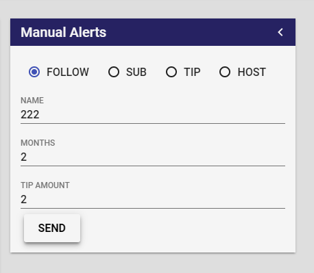

# prime-manual-alerts
A manual alert sender. Listen to enable an alerts bundle to be tested by the user easily.

This is a NodeCG 0.9 Bundle.



## Events

### FOLLOW 

``` 
{
	"username":"user",
	"ts":<Unix timestamp>,
	"type":"follow"
}
```

### SUBSCRIPTION

``` 
{
	"username":"user",
	"ts":<Unix timestamp>,
	"type":"subscription",
	"months":2
}
```

### HOST
``` 
{
	"username":"user",
	"ts":<Unix timestamp>,
	"type":"host"
}
```

### TIP

``` 
{
	"username":"user",
	"ts":<Unix timestamp>,
	"type":"tip",
	"amount":20,
	"currencySymbol":"$"
}
```

## Example Use

```
nodecg.listenFor('follow','prime-manual-alerts', data => {
	console.log(data);
});
